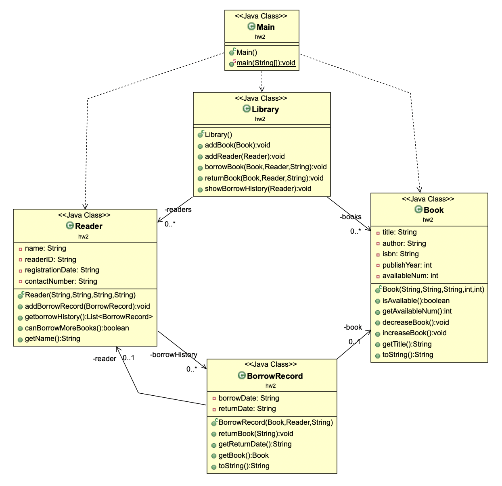

## HW2
A library wants to build a management system to efficiently manage books, readers, and borrowing records. The system needs to be able to track the availability of books, reader information, and their borrowing history.

- **Books (Book)**: Each book should have a title, author, ISBN number, publication year, and available quantity. Books can be borrowed or returned.

- **Readers (Reader)**: Each reader should have a name, reader ID, registration date, and contact phone number. Readers can borrow books, and each reader can borrow up to three books at the same time.

- **Borrowing Record**: Each borrowing record should include the borrowing date, return date, and information about the related book and reader.

- The system should be able to display each reader's borrowing history.  
**Library**: The library contains multiple books and multiple readers. The library can manage the borrowing and returning process for books.

---

